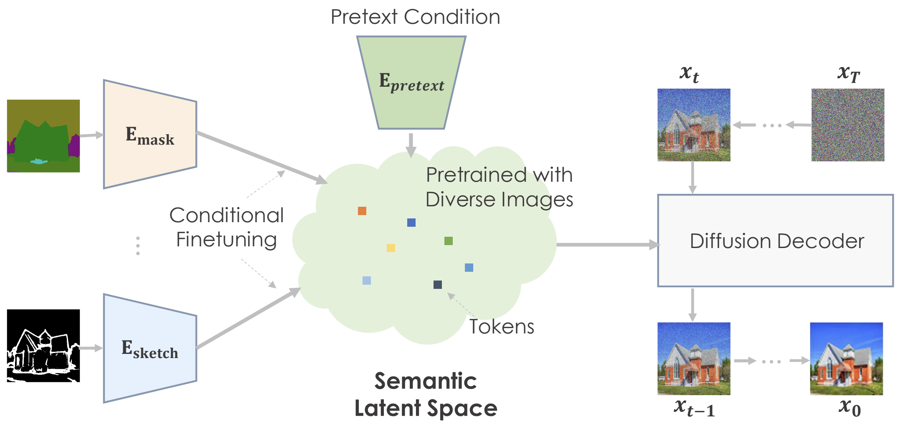
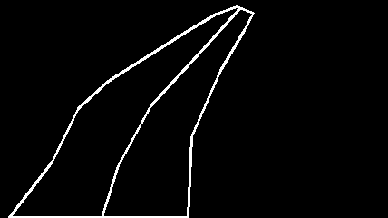
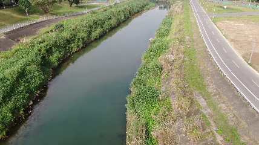
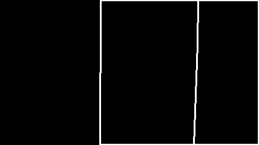
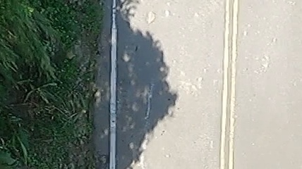
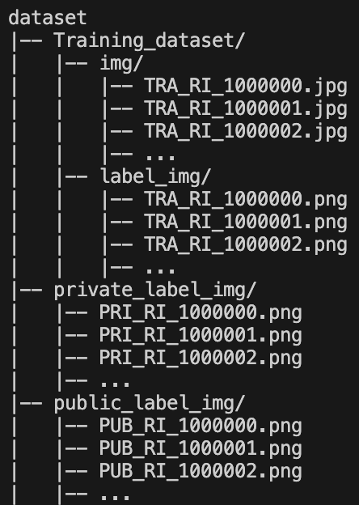
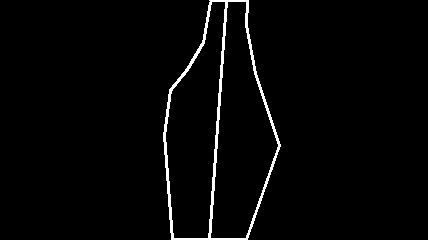
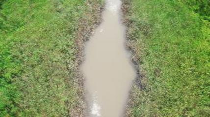
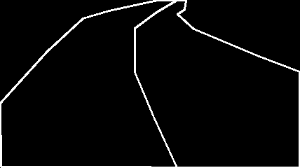
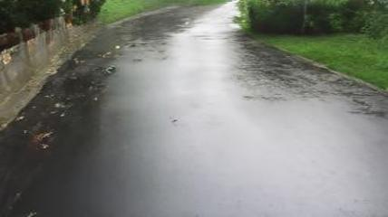

# AICUP 建構無人機於自然環境偵察時所需之導航資訊競賽 I－ 影像資料生成競賽

## 介紹
比賽目標通過輸入道路與河川的草圖 (sketch) 生成對應的真實影像。最終，通過生成影像與真實影像間的 FID score 作為評分標準。本專案是基於 [**PITI (Pretraining is All You Need for Image-to-Image Translation**)](https://github.com/PITI-Synthesis/PITI) 的原始碼進行修改的。
1. **隊伍**: TEAM_5411
2. **隊員**: 胡太維 (隊長)、徐黎安、王柏靇
3. **最終排名**: 2 (共 130 隊)
4. **Private leaderboard**: 84.26206



|||
|------------------------|------------------------|
|||
    

## 軟硬體設定
1. 操作系統: Linux
2. GPU: L4 (24 GB)
3. Python 版本: 3.7.11

## 環境
```
conda env create -f environment.yml
``` 

## 前置作業
1. **下載比賽資料，並放置於 `dataset/` 路徑下**
   + `dataset/Training dataset/`
   + `dataset/public_label_img/`
   + `dataset/private_label_img/`
   
   <p align = "left">     
   
   </p>


2. **前處理**
   ```bash
   python preprocess/aicup_preprocess.py --root ./Trainig_dataset \
                                         --save_dir dataset \
                                         --test_size 0.1                    
   ```


## 模型訓練
分為河道 (river) 生成、道路 (road) 生成兩個任務，每個任務都需要訓練兩個模型，分別為 **sketch-to-image** 模型，該模型會根據草圖 (sketch) 生成對應的影像，大小為 64x64，另一個模型為 **super-resolution** 模型，會將 64x64 大小的影像轉換為 256x256 的影像。訓練 sketch-to-image 模型時，需要先對 encoder 進行 2 次微調 (stage1, stage2)，接著，再對 encoder 與 decoder 同時進行微調 (stage3)。訓練 super-resolution 模型時，會對 encoder 與 decoder 同時進行微調。\
訓練前，請在專案路徑下創建 `pretrained/` 資料夾，並至[以下連結](https://drive.google.com/drive/u/0/folders/1CVtu32Clq63j-17CvyBatKQtFLxW0VRk)下載所有預訓練權重，並放在 `pretrained/` 資料夾中。

1. **訓練 sketch-to-image 模型**
   + **river 模型**
     ```
     bash sketch_finetune_base.sh river
     ```
   + **road 模型**
     ```
     bash sketch_finetune_base.sh road
     ```
2. **訓練 upsample 模型**
   + **river 模型**
     ```
     bash sketch_finetune_upsample.sh river
     ```
   + **road 模型**
     ```
     bash sketch_finetune_upsample.sh road
     ```


## 模型推理
|||
|------------------------|------------------------|
|||

1. **生成道路影像**
    ```shell
    python inference.py --encoder_ckpt coco-edge/coco-64-stage1-cont_river/checkpoints/ema_0.999_020000.pt \
                        --decoder_ckpt pretrained/base_edge_decoder.pt \
                        --sr_model_path pretrained/road_upsample_ema_0.999_060000.pt \
                        --image dataset/Private_testing_dataset/label_img/*RO*.png \
                        --save_dir ./results
                        --num_samples 40
    ```

2. **生成河流影像**
    ```shell
    python inference.py --encoder_ckpt coco-edge/coco-64-stage1-cont_road/checkpoints/ema_0.999_020000.pt \
                        --decoder_ckpt pretrained/base_edge_decoder.pt \
                        --sr_model_path ./pretrained/river_upsample_ema_0.999_060000.pt \
                        --image dataset/Private_testing_dataset/label_img/*RI*.png \
                        --save_dir ./results
                        --num_samples 40
    ```

3. **篩選合適的影像**
    ```shell
    python optimize_fid.py --real_dir dataset/Training_dataset/img \
                           --gen_dir ./results \
                           --save_dir ./results_40_20 \
                           --batch_size 256 \
                           --num_sample 40 \
                           --freq 2 \
                           --model resnet34
    ```
4. **轉換為提交格式**
   ```shell
   python convert_to_submit.py --image_dir ./results_40_20 \ 
                               --save_dir ./submit
   ```
